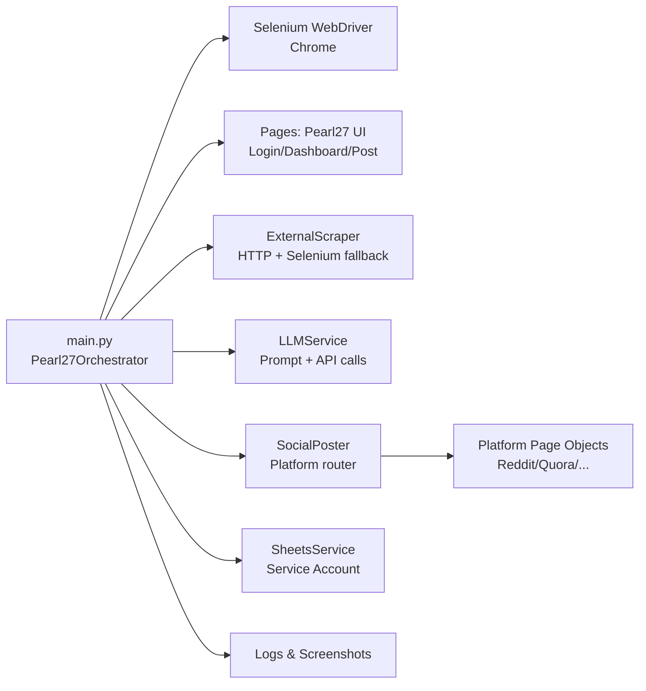

# Pearl27 Automation


Production-grade browser automation that orchestrates the **Pearl27 “Drumming” workflow** end-to-end: discovers and assigns tasks, scrapes external post context, generates an LLM-backed reply, posts the reply on the target social platform, advances the Pearl27 status flow, and logs completions to Google Sheets.

---

## Table of Contents

- [1 🚀 Project Overview](#1--project-overview)
- [2 ⚙️ Core Features & Functionality](#2-️-core-features--functionality)
- [3 🏗️ Technical Architecture](#3-️-technical-architecture)
- [4 🛡️ Security & Compliance](#4-️-security--compliance)
- [5 📈 Scalability & Performance](#5--scalability--performance)
- [6 ☁️ Deployment & Environment](#6-️-deployment--environment)
- [7 👥 Target Users & Use Cases](#7--target-users--use-cases)
- [8 🧭 Future Roadmap](#8--future-roadmap)

---

## 1 🚀 Project Overview

### 1.1 Purpose

Pearl27 Automation is a **Python + Selenium** orchestrator designed to reliably execute a repeatable “drumming” process across multiple social platforms while keeping Pearl27 task state and operational logs consistent and auditable.

### 1.2 Vision

Provide a maintainable, scalable automation foundation that:

- Produces consistent, brand-aligned responses using controlled prompt templates.
- Minimizes operator effort via deterministic task selection and end-to-end execution.
- Improves traceability through structured logging, screenshots on failure, and Sheets-based activity logging.

### 1.3 High-Level Lifecycle

The orchestrator (`main.py`) follows a deterministic phase pipeline:

1. Login to Pearl27
2. Discover and assign the best eligible post (score-based)
3. Open the post detail
4. Scrape external content and comments
5. Apply keyword guardrails (skip if “lifewood” is detected with fuzzy matching)
6. Generate a platform-aware LLM response (Standard vs Quora modes)
7. Post the response to the target social platform
8. Advance Pearl27 status flow (e.g., Not Ready → Draft Ready → Approved → Complete)
9. Append a completion record to Google Sheets

---

## 2 ⚙️ Core Features & Functionality

### 2.1 Feature Matrix

| Capability | Description | Primary Module(s) |
|---|---|---|
| Pearl27 login | Robust selectors + fallbacks for SPA hydration and invitation code field | `pages/login_page.py` |
| Task discovery & assignment | Scans dashboard cards, filters eligible posts, assigns to account, selects by score | `pages/dashboard_page.py` |
| Status workflow | Advances status sequentially using dropdown/buttons with safe fallbacks | `pages/post_page.py` |
| External scraping | HTTP-first scrape with Selenium fallback; Quora prefers Selenium; extracts title/body/comments | `services/scraper.py` |
| Guardrails (keyword skip) | Fuzzy keyword detection to prevent unsafe/undesired engagement | `utils/helpers.py`, `services/scraper.py` |
| LLM comment generation | Mode detection (Quora/Standard), prompt formatting, retries/backoff | `services/llm_services.py` |
| Social posting router | URL-based platform detection, credential lookup, login caching per run | `services/social_poster.py` |
| Platform-specific automations | Dedicated page objects per platform for login and posting | `pages/social/*.py` |
| Google Sheets audit logging | Service account auth and append/update by column map | `services/sheets_service.py` |
| Observability & debugging | Console + rotating file logs; screenshots on key failures | `utils/logger.py`, `pages/base_page.py` |

### 2.2 Primary Workflow (Operator View)

#### 2.2.1 Typical Run

- Start a run via `python main.py`
- Optionally run headless via `python main.py --headless`
- Optionally dry-run (no social posting / no Sheets writes) via `python main.py --dry-run`

#### 2.2.2 What “Dry-Run” Does

Dry-run is intended for verification and selector tuning:

- Executes login, discovery, scrape, and LLM generation.
- Skips platform posting and Sheets writes.
- Helps validate scraping quality and prompt outcomes without external side effects.

### 2.3 Integrations

#### 2.3.1 LLM Provider (OpenAI-Compatible / Anthropic-Compatible Endpoint)

The system calls a chat-completions style API via `requests.Session`:

- Endpoint and model are configured via `.env` (`LLM_BASE_URL`, `LLM_MODEL`, `LLM_API_KEY`).
- The request/response handler supports both:
  - Anthropic “Messages API”-like responses (`content[0].text`)
  - OpenAI-compatible responses (`choices[0].message.content`)

#### 2.3.2 Google Sheets

The system logs each completed post to a tracking sheet:

- Auth: Google Service Account JSON key file (path configured via `.env`)
- Writes: row updates aligned to a defined column map
- Record shape: site, username/account, drummer name, date, platform, link

#### 2.3.3 Supported Social Platforms (Automated Posting)

| Platform | Posting Approach | Module |
|---|---|---|
| Reddit | New UI (contenteditable) + old UI textarea fallbacks | `pages/social/reddit_page.py` |
| Quora | Answer-first then comment fallback | `pages/social/quora_page.py` |
| LinkedIn | Platform-specific page object | `pages/social/linkedin_page.py` |
| Facebook | Platform-specific page object | `pages/social/facebook_page.py` |
| YouTube | Platform-specific page object | `pages/social/youtube_page.py` |
| TikTok | Platform-specific page object | `pages/social/tiktok_page.py` |
| Instagram | Platform-specific page object | `pages/social/instagram_page.py` |
| Pinterest | Platform-specific page object | `pages/social/pinterest_page.py` |

> Note: Social selectors are subject to frequent UI changes. Platform page objects are intentionally isolated to reduce blast radius when selectors need updates.

---

## 3 🏗️ Technical Architecture

### 3.1 System Components (Logical)



### 3.2 Codebase Organization

| Area | Responsibility | Notes |
|---|---|---|
| `main.py` | Orchestration phases, CLI, lifecycle (`setup/run/teardown`) | Single entry point |
| `config.py` | Typed environment configuration via `.env` | Secrets masked in `__repr__` |
| `pages/` | Page Object Model for Pearl27 UI | Selenium best-practices wrappers |
| `pages/social/` | Page Objects for social platforms | Login + post primitives |
| `services/` | Business services: scrape, LLM, sheets, router | Clean separation from UI pages |
| `utils/` | Logging, retry, fuzzy matching, formatting helpers | Shared utilities |

### 3.3 Tech Stack (Implementation)

| Layer | Technology | Purpose |
|---|---|---|
| Runtime | Python 3.12+ | Primary language/runtime |
| Browser automation | Selenium + ChromeDriver (via `webdriver-manager`) | Pearl27 + social platform automation |
| Scraping | `requests`, BeautifulSoup (`lxml`), Selenium fallback | External page parsing |
| AI/LLM | HTTP API via `requests` | Comment generation |
| Logging/observability | `colorlog` + rotating file handler | Operational visibility |
| Data/Audit store | Google Sheets (`gspread`, Google Auth) | Appendable completion log |

### 3.4 Execution Model

- **Single-run, sequential pipeline**: processes up to a configured maximum per execution (`MAX_POSTS_PER_RUN` in `main.py`).
- **Login caching per platform**: social page objects cache authentication state for the run to reduce re-logins.
- **Resilience**: retry patterns are used for scraping and API requests; UI actions use explicit waits and guarded fallbacks.

---

## 4 🛡️ Security & Compliance

### 4.1 Authentication & Authorization

#### 4.1.1 Pearl27 Credentials

- Stored as environment variables in `.env` (never hard-coded).
- Accessed through `config.py` typed config objects.

#### 4.1.2 Social Platform Credentials

- Stored per platform in `.env` (optional, only required for the platforms you actively post to).
- Resolved at runtime based on the detected platform domain.

#### 4.1.3 Google Sheets Service Account

- Uses a Service Account JSON key file (e.g., `credentials/service_account.json`).
- The file path is configured via `.env` and should be excluded from version control.

### 4.2 Data Protection Controls

- **Secret hygiene**: `.env` and service account keys should not be committed.
- **Masked logging**: config `__repr__` and helper functions mask sensitive values.
- **Least data retention**: operational logs and Sheets records store task metadata and links, not raw credential material.

### 4.3 Operational Compliance Alignment (Practical)

This system automates interactions on third-party platforms. Alignment considerations:

- Respect platform terms-of-service and internal policy controls.
- Implement rate limiting and human-in-the-loop approvals for sensitive accounts if required.
- Maintain an auditable record of activity via Sheets and rotating logs.

---

## 5 📈 Scalability & Performance

### 5.1 Modularity & Maintainability

- **Page Object Model** isolates selector volatility in `pages/` and `pages/social/`.
- **Service layer** cleanly separates scraping, LLM calls, posting, and logging.
- **Typed config** centralizes runtime configuration and makes deployment safer.

### 5.2 Load Handling Strategy

Current execution is intentionally conservative (sequential automation). To scale safely:

- Increase throughput by processing more than one post per run (configurable in `main.py`).
- Move to multi-run scheduling (e.g., periodic runs) rather than concurrent sessions to reduce lockouts.
- Use per-platform throttling and exponential backoff when encountering rate limits.

### 5.3 Optimization Opportunities

| Area | Current Approach | Optimization Strategy |
|---|---|---|
| Browser boot time | Fresh driver per run | Reuse a long-lived worker process where safe |
| Scrape latency | HTTP-first, Selenium fallback | Platform-specific extraction and caching |
| LLM cost/time | Single call per post | Add prompt compression and token budgeting |
| Selector failures | Defensive fallbacks | Add DOM snapshots + selector health checks |

---

## 6 ☁️ Deployment & Environment

### 6.1 Local Setup

#### 6.1.1 Prerequisites

- Python 3.12+
- Google Chrome (for Selenium automation)

#### 6.1.2 Install

```bash
python -m venv venv
.\venv\Scripts\Activate.ps1
pip install -r requirements.txt
```

#### 6.1.3 Configure Environment

1. Copy `.env.example` to `.env`
2. Populate required values:
   - `PLATFORM_URL`, `PLATFORM_USERNAME`, `PLATFORM_PASSWORD`, `INVITATION_CODE`
   - `LLM_API_KEY` (and optionally `LLM_MODEL`, `LLM_BASE_URL`)
   - `GOOGLE_SHEET_ID` (and service account JSON path)
3. Place your service account file at `credentials/service_account.json` (or adjust `GOOGLE_SERVICE_ACCOUNT_JSON`)

#### 6.1.4 Run

```bash
python main.py
python main.py --headless
python main.py --dry-run
```

### 6.2 CI/CD (Recommended Industry Pattern)

This repository currently runs as a CLI orchestrator. For team-grade operations, a typical CI/CD setup would include:

- Linting and formatting checks
- Unit tests for service logic (scraper parsing, prompt formatting, URL routing)
- Scheduled execution (cron/Task Scheduler) and/or a runner service
- Secure secret injection (CI secrets store; never commit `.env`)

### 6.3 Containerization (Optional)

If deploying to a server/VM, containerization can standardize:

- Python runtime + dependencies
- Headless Chrome runtime
- Volume mounts for `credentials/` and `logs/`

> Note: Headless browser containers require extra setup (Chrome/Chromedriver, shared memory, sandbox flags). This is best implemented when you confirm the target execution environment (Windows VM vs Linux server).

---

## 7 👥 Target Users & Use Cases

### 7.1 Target Personas

1. **Operations Specialist / Drummer**
   - Needs a reliable tool to process assigned tasks with minimal manual work.
2. **QA / Automation Maintainer**
   - Tunes selectors, validates workflow health, and investigates failures via logs/screenshots.
3. **Team Lead / Compliance Reviewer**
   - Requires an auditable trail of activity and predictable guardrails.

### 7.2 Representative Use Cases

| Scenario | Input | Output / Value |
|---|---|---|
| Daily drumming run | Pearl27 tasks + social credentials | Completed posts, consistent status flow, Sheets log entries |
| Safe validation run | `--dry-run` | No external side effects; validates selectors/scraping/LLM |
| Platform expansion | Add new domain mapping + page object | Controlled addition without impacting existing platforms |

---

## 8 🧭 Future Roadmap

### 8.1 Reliability & Observability

- Add structured JSON logs (run id, post id, phase timing, error categories)
- Persist DOM snapshots on selector failures for faster debugging
- Add health checks for known platform UI changes

### 8.2 Scalability & Operations

- Make `MAX_POSTS_PER_RUN` configurable via `.env` or CLI
- Introduce a scheduler mode with fixed cadence and backoff
- Add concurrency only where safe (e.g., parallel HTTP scraping) while keeping browser actions serialized

### 8.3 AI Quality & Brand Controls

- Add a policy layer for brand voice, prohibited content, and citation requirements
- Add prompt templates per platform/community (e.g., subreddit-specific tone control)
- Add “human approval” mode for high-risk accounts or sensitive keywords

### 8.4 Engineering Quality

- Add unit tests for:
  - `SocialPoster` routing and credential resolution
  - scraper parsing and keyword guardrails
  - prompt building and post-processing constraints
- Add a lint/format baseline (e.g., `ruff`) and CI workflow

---

## Appendix A: Configuration Reference (Summary)

Key files:

- `.env.example` – documented environment variables (copy to `.env`)
- `config.py` – typed configuration loader

Minimum required variables to run end-to-end:

- Pearl27: `PLATFORM_URL`, `PLATFORM_USERNAME`, `PLATFORM_PASSWORD`, `INVITATION_CODE`
- LLM: `LLM_API_KEY`
- Sheets: `GOOGLE_SHEET_ID`, `GOOGLE_SERVICE_ACCOUNT_JSON`

